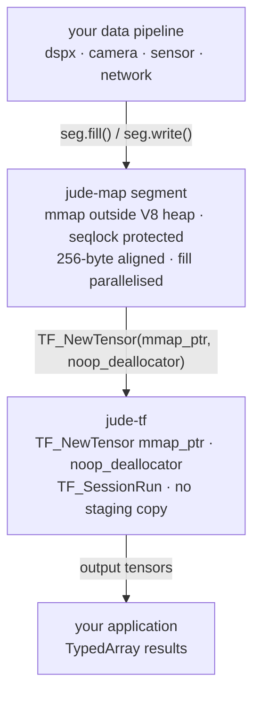

# jude

_Named after St. Jude, patron of hopeless causes — like getting Node.js to beat Python at ML inference._

A monorepo for high-performance TensorFlow inference in Node.js. The architecture is built around one insight: the bottleneck in a Node.js ML pipeline is never the JavaScript — it's the copies. Every boundary between JS and C++, between threads, between the CPU and the GPU costs a memcpy. This stack eliminates them.

---

## Packages

### [`jude-map`](./jude-map)

mmap-backed shared tensor memory with seqlock consistency. The transport layer — sits between your data pipeline and inference. No TensorFlow dependency.

- Segments live outside the V8 heap — no 4 GB ceiling, no GC pressure
- Seqlock writer-priority consistency with zero kernel involvement in the fast path
- `fill()` / `fillAsync()` for large tensors without allocating a V8 buffer
- `readWait()` parks on libuv `uv_async` — zero CPU while waiting, wakes on writer commit
- `pin()` page-locks the mapping for CUDA H2D zero-copy DMA
- `destroyAsync()` pushes the slow `munmap` page-table walk off the event loop

### [`jude-tf`](./jude-tf)

TensorFlow C API bindings for Node.js. Loads SavedModels and frozen graphs, auto-detects inputs and outputs from `SignatureDef` by parsing `saved_model.pb` directly (no protobuf dependency), and runs inference with a zero-copy path from jude-map segments to `TF_NewTensor`.

- SavedModel and frozen graph (.pb) support
- SignatureDef auto-detection via minimal binary protobuf parser
- Zero-copy inference: jude-map mmap pointer → `TF_NewTensor` → GPU DMA
- CPU today, GPU path prepared (page-locked segments, 256-byte aligned `DATA_OFFSET`)

---

## Repository layout

```
jude-map/               Transport layer — no ML dependencies
  src/native/           C++ N-API addon
  src/ts/               TypeScript wrapper + tests
  binding.gyp

jude-tf/                TensorFlow inference
  src/native/           C++ N-API addon (tf_session.cc, proto_parser.h)
  src/ts/               TypeScript wrapper + tests
  binding.gyp

.github/workflows/
  ci.yml                Path-filtered per-package, libtensorflow cached
  prebuilds.yml         Tag-triggered prebuild matrix

package.json            Workspace root
```

---

## Getting started

```bash
git clone https://github.com/A-KGeorge/jude
cd jude
npm install
```

Install libtensorflow before building `jude-tf` (not required for `jude-map`):

```bash
# Linux
wget https://storage.googleapis.com/tensorflow/versions/2.18.1/libtensorflow-cpu-linux-x86_64.tar.gz
sudo tar -C /usr/local -xzf libtensorflow-cpu-linux-x86_64.tar.gz
sudo ldconfig

# macOS
wget https://storage.googleapis.com/tensorflow/versions/2.18.1/libtensorflow-cpu-darwin-arm64.tar.gz
sudo tar -C /usr/local -xzf libtensorflow-cpu-darwin-arm64.tar.gz

# Windows (PowerShell)
Invoke-WebRequest -Uri "https://storage.googleapis.com/tensorflow/versions/2.18.1/libtensorflow-cpu-windows-x86_64.zip" -OutFile libtf.zip
Expand-Archive libtf.zip -DestinationPath C:\libtensorflow
# Add C:\libtensorflow\lib to PATH
```

Build both packages:

```bash
npm run build --workspace=jude-map
npm run build --workspace=jude-tf   # requires libtensorflow
```

Run tests:

```bash
npm test --workspace=jude-map
npm test --workspace=jude-tf
```

---

## How the zero-copy path works



The mmap pointer goes directly into `TF_NewTensor` with a no-op deallocator. TensorFlow's internal `gpu_private` host threads see the buffer as pinned host memory and can initiate H2D DMA without an intermediate staging copy — provided `seg.pin()` was called before `TF_SessionRun`.

---

## Benchmark context

10 GB float32 fill, Node.js vs Python:

| Operation    | Node (jude-map)        | Python (numpy)        |
| ------------ | ---------------------- | --------------------- |
| sync fill    | 601ms / 16.6 GB/s      | 1194ms / 8.4 GB/s     |
| async fill   | 785ms (loop alive)     | 1305ms (loop blocked) |
| destroy      | 259ms                  | 377ms                 |
| destroyAsync | **0.1ms** (background) | 349ms (blocking)      |

Python's `np.full` blocks the entire interpreter. `fillAsync` keeps the event loop alive throughout, demonstrated by timer ticks firing during the fill. `destroyAsync` returns in 0.1ms — the slow page-table walk runs on the libuv thread pool.

---

## Requirements

- Node.js >= 18
- npm >= 11.5.1
- **jude-tf only**: libtensorflow 2.x C library ([download](https://www.tensorflow.org/install/lang_c))
- Build toolchain (only needed when prebuilds are unavailable):
  - Linux/macOS: GCC or Clang with C++17, Python 3
  - Windows: Visual Studio 2022 with "Desktop development with C++", Python 3

---

## License

Apache-2.0 © Alan Kochukalam George
