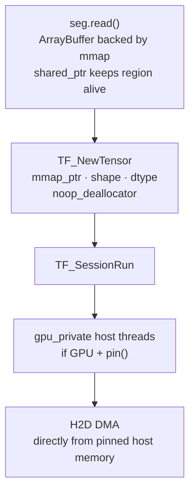

# jude-tf

TensorFlow C API bindings for Node.js with zero-copy inference via [jude-map](../jude-map).

Loads SavedModels and frozen graphs, auto-detects inputs and outputs from `SignatureDef` by parsing `saved_model.pb` directly without a protobuf runtime dependency, and hands jude-map mmap pointers straight into `TF_NewTensor` — no intermediate copy between your data pipeline and the TF runtime.

---

## Why not tfjs-node?

`tfjs-node` bundles its own internal copy of libtensorflow but only exposes a JavaScript surface over it. You cannot pass an external memory pointer to it, cannot control tensor lifetime, and cannot reach `TF_NewTensor` with `TF_DONT_DEALLOCATE_CONTENTS`. The moment you need zero-copy inference from a large shared buffer — or anything larger than ~2 GB — tfjs-node is the wrong tool.

jude-tf exposes the C API directly, which means:

- `TF_NewTensor` with a noop deallocator — the mmap pointer goes in, no copy
- `TF_SessionRun` without going through V8 for tensor data
- GPU `gpu_private` host threads see the buffer as pinned host memory when `seg.pin()` has been called — H2D DMA without a staging copy

---

## Requirements

- Node.js >= 18
- jude-map >= 0.0.0-alpha (peer dependency)
- libtensorflow 2.x C library — [install instructions below](#installing-libtensorflow)
- Build toolchain (if prebuilds unavailable):
  - Linux/macOS: GCC or Clang with C++17, Python 3
  - Windows: Visual Studio 2022, "Desktop development with C++", Python 3

---

## Installing libtensorflow

Set `LIBTENSORFLOW_PATH` before building if you install to a non-default location. `binding.gyp` reads this variable to find headers and libraries.

**Linux:**

```bash
wget https://storage.googleapis.com/tensorflow/versions/2.18.1/libtensorflow-cpu-linux-x86_64.tar.gz
sudo tar -C /usr/local -xzf libtensorflow-cpu-linux-x86_64.tar.gz
sudo ldconfig
```

**macOS:**

```bash
# Apple Silicon
wget https://storage.googleapis.com/tensorflow/versions/2.18.1/libtensorflow-cpu-darwin-arm64.tar.gz
sudo tar -C /usr/local -xzf libtensorflow-cpu-darwin-arm64.tar.gz

# Intel
wget https://storage.googleapis.com/tensorflow/versions/2.18.1/libtensorflow-cpu-darwin-x86_64.tar.gz
sudo tar -C /usr/local -xzf libtensorflow-cpu-darwin-x86_64.tar.gz
```

**Windows (PowerShell):**

```powershell
Invoke-WebRequest -Uri "https://storage.googleapis.com/tensorflow/versions/2.18.1/libtensorflow-cpu-windows-x86_64.zip" -OutFile libtf.zip
Expand-Archive libtf.zip -DestinationPath C:\libtensorflow
# Add C:\libtensorflow\lib to PATH so tensorflow.dll is found at runtime
[Environment]::SetEnvironmentVariable("PATH", $env:PATH + ";C:\libtensorflow\lib", "User")
$env:LIBTENSORFLOW_PATH = "C:\libtensorflow"
```

---

## Installation

```bash
npm install jude-tf
```

Building from source:

```bash
cd jude-tf
npm ci
npm run build
```

---

## Quick Start

### SavedModel

```ts
import { TFSession } from "jude-tf";
import { SharedTensorSegment, DType } from "jude-map";

// Load a SavedModel — SignatureDef parsed automatically from saved_model.pb
const sess = await TFSession.loadSavedModel("./my_model");

// Inspect what the model expects
console.log(sess.activeSignature?.inputs);
// { x: { name: "serving_default_x:0", dtype: 1, shape: [-1, 784] } }

// Zero-copy path — segment mmap pointer goes directly into TF_NewTensor
const seg = new SharedTensorSegment(784 * 4); // 784 float32 inputs
seg.fill([784], DType.FLOAT32, 0.5);

const result = await sess.run({ x: seg });
console.log(result.output_0.data); // Float32Array of predictions

seg.destroy();
sess.destroy();
```

### Frozen graph

```ts
import { TFSession } from "jude-tf";

const sess = await TFSession.loadFrozenGraph("./model.pb");

// For frozen graphs, use the op names directly as input keys
const result = await sess.run({
  input: new Float32Array(784).fill(0.5),
});

sess.destroy();
```

---

## Zero-copy inference path

When you pass a `SharedTensorSegment` to `run()`, jude-tf calls `seg.read()` to get the mmap `ArrayBuffer`, then wraps it with `TF_NewTensor` using a no-op deallocator:



No data is copied. TensorFlow borrows the buffer for the duration of `TF_SessionRun`. The `shared_ptr<MmapRegion>` in jude-map ensures the mapping stays valid even if `seg.destroy()` is called before the session finishes.

For the GPU DMA path to be zero-copy end-to-end, call `seg.pin()` before `sess.run()`:

```ts
const seg = new SharedTensorSegment(N * 4);
seg.pin(); // page-lock for CUDA H2D DMA
await seg.fillAsync([N], DType.FLOAT32, 0.0);

const result = await sess.run({ x: seg });

seg.unpin();
seg.destroy();
```

---

## API

### `TFSession.loadSavedModel(dir, tags?)`

Loads a TensorFlow SavedModel from a directory. Parses `saved_model.pb` to extract all `SignatureDef` entries — no protobuf runtime required, the parser is a minimal binary wire-format decoder built into the native addon.

- `dir` — path to the SavedModel directory (must contain `saved_model.pb`)
- `tags` — MetaGraph tags to load (default: `["serve"]`)

Returns `Promise<TFSession>`.

### `TFSession.loadFrozenGraph(path)`

Loads a frozen `GraphDef` from a `.pb` file. Inputs are inferred from `Placeholder` ops in the graph. Use op names directly as input keys in `run()`.

Returns `Promise<TFSession>`.

### `sess.run(inputs, outputKeys?)`

Run inference.

- `inputs` — map from input key to data source:
  - `SharedTensorSegment` — zero-copy, mmap pointer passed directly to `TF_NewTensor`
  - `TypedArray` — copied into a new `TF_Tensor`
- `outputKeys` — which outputs to compute (default: all outputs in the active signature)

Returns `Promise<Record<string, TensorResult>>` where each value has `{ dtype, shape, data: TypedArray }`.

### `sess.signatures`

All `SignatureDef` entries detected from `saved_model.pb`, keyed by signature name.

```ts
interface SignatureDef {
  inputs: Record<string, TensorInfo>;
  outputs: Record<string, TensorInfo>;
  methodName: string;
}

interface TensorInfo {
  name: string; // graph node name, e.g. "serving_default_x:0"
  dtype: number; // TF_DataType integer
  shape: number[]; // dimension sizes (-1 = unknown)
}
```

### `sess.activeSignature`

Convenience accessor — returns `signatures["serving_default"]`, then the first signature with a `predict` method name, then the first signature found. `null` for frozen graphs.

### `sess.destroy()`

Closes the TF session and releases all C++ resources. Unusable after this call.

---

## SignatureDef detection

jude-tf does not depend on the protobuf runtime. It includes a minimal binary wire-format parser (`proto_parser.h`) that decodes exactly the fields needed from `saved_model.pb`:

```
SavedModel.meta_graphs[0].signature_def
  └── "serving_default"
        ├── inputs  → { key: TensorInfo }
        └── outputs → { key: TensorInfo }
              └── TensorInfo: { name, dtype, tensor_shape }
```

The parser is ~250 lines of header-only C++, zero allocations for the field traversal itself, and handles arbitrarily nested maps without a generated proto schema.

---

## Building from source

```bash
# From the repo root
npm install
LIBTENSORFLOW_PATH=/usr/local npm run build --workspace=jude-tf

# Or from the jude-tf directory
cd jude-tf
LIBTENSORFLOW_PATH=/usr/local npm run build
npm test
```

On Windows set `LIBTENSORFLOW_PATH` as a user environment variable rather than inline.

---

## Current status

- [x] SavedModel loading
- [x] Frozen graph loading
- [x] SignatureDef auto-detection (binary protobuf parser, no runtime dependency)
- [x] Zero-copy inference from jude-map segments
- [x] TypedArray input path (copy)
- [x] CPU inference
- [x] `runAsync()` — `TF_SessionRun` on libuv thread pool (event loop free during inference)
- [ ] SavedModel variable restoration (ResourceVariable checkpoint loading via C API)
- [ ] GPU inference path (CUDA session options, `TF_GPU_THREAD_MODE`)
- [ ] TFLite (separate target, different C API)

---

## License

Apache-2.0 © Alan Kochukalam George
